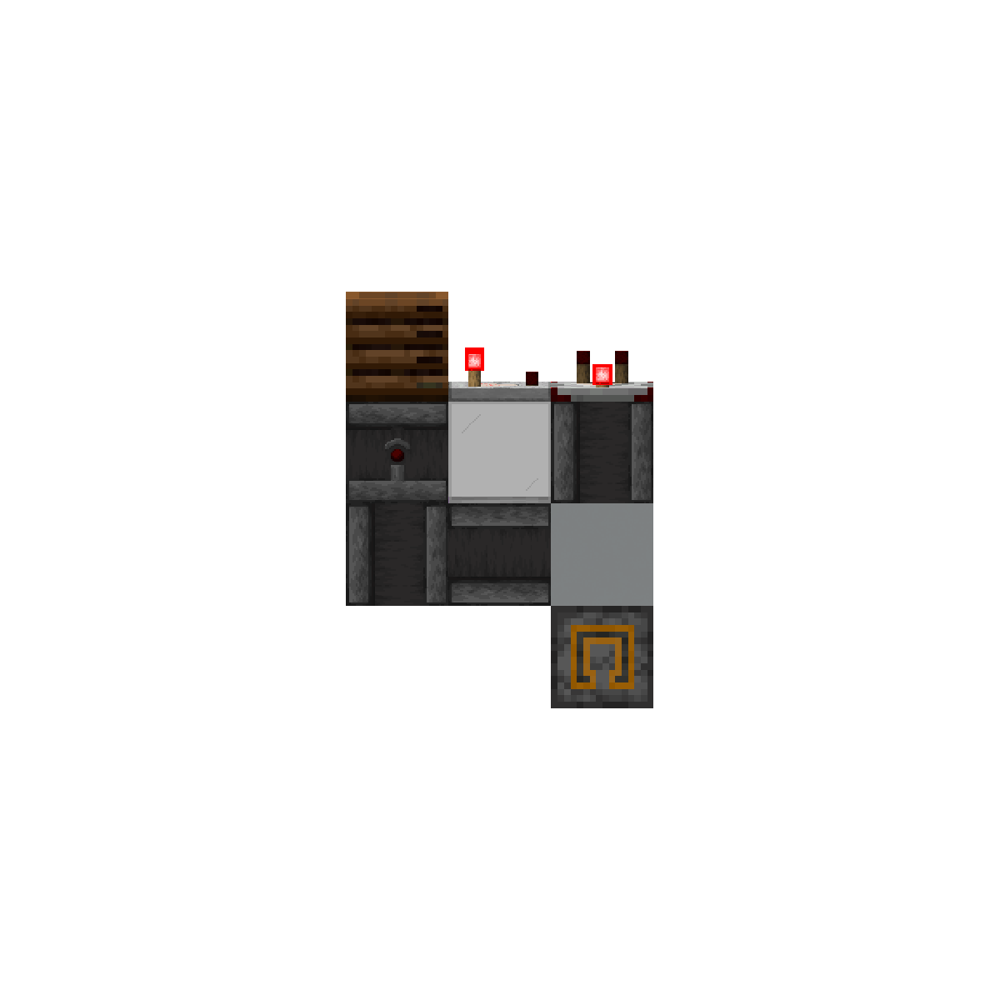
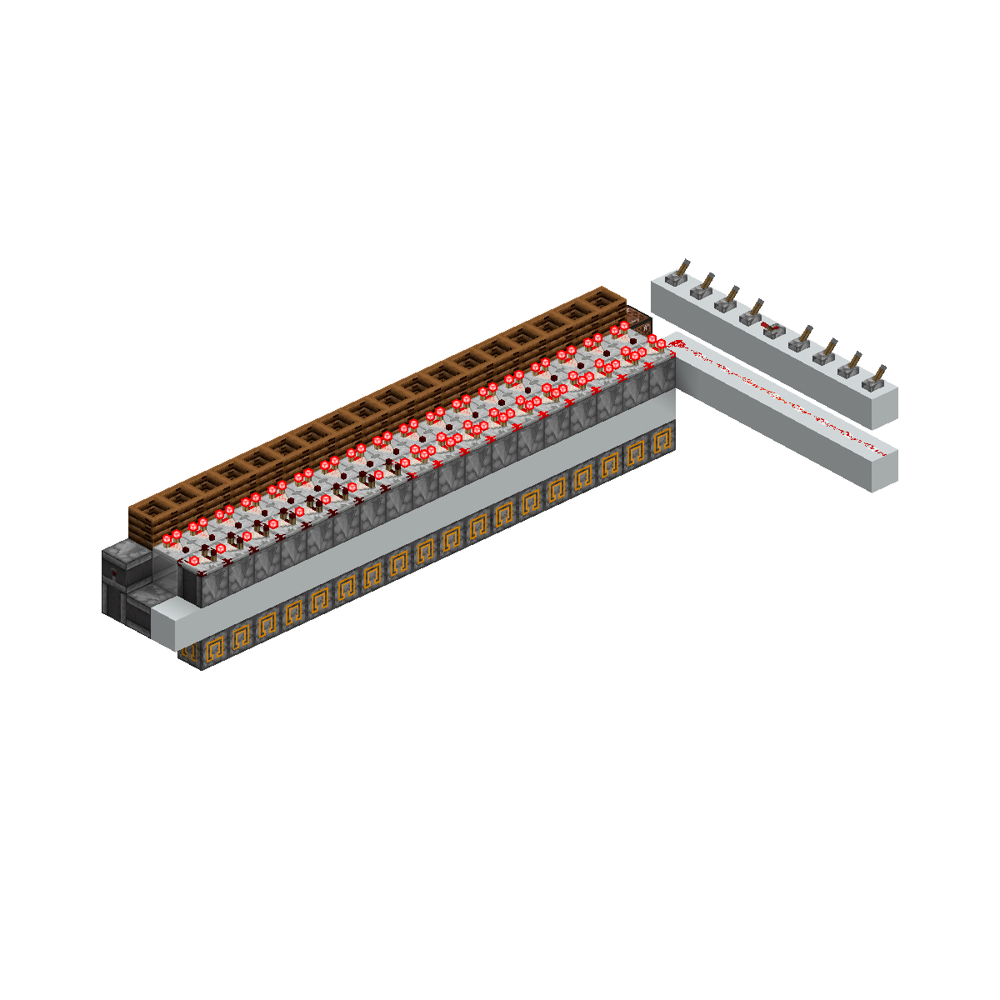

## 前言

在上一篇文章中，我们已经学会了如何使用码进行基本的逻辑处理。这一章，我们继续进入16进制和模电的世界。

## 什么是16进制？

前面我们已经知道，码不一定只是普通数字；到了16进制，这个特点会更加明显。

16进制使用16个符号表示数值：

0、1、2、3、4、5、6、7、8、9、A、B、C、D、E、F

其中，A-F分别表示十进制的10-15。

例如：

FE8 = F、E、8 = 15、14、8

这里的FE8不一定要先把它看成一个复杂数字，也可以先把它看成由三个16进制码组成的编码。

实际上，16进制最核心的思想就是一句话：层级表示。每一位都表示一个16选1的分类；位数越多，能表示的信息就越丰富。

> 通俗点来说，就像图书馆按字母排序。先根据第一个字母确定大致区域（A～Z），再根据后面的字母继续细分，最后就能快速找到对应的书

一个很好的例子：两位16进制，第一位确认组，第二位确认片，这样就能解码了

### 跟二进制的换算

4位二进制一共有16种不同的组合，因此可以用1位16进制完整表示。

例如：

```
0000 = 0
1001 = 9
1010 = A
1111 = F
```

至于反算，一种方式是查表，但是那样就太sb了，实际上我们可以这么计算：

```
E = 14
14 = 8 + 4 + 2

所以：
8 4 2 1
1 1 1 0
E = 1110
```

再举一个：

```
B = 11
11 = 8 + 2 + 1

8 4 2 1
1 0 1 1
B = 1011
```
在mc中的例子则是

具体的计算你可以自己百度/Google，本文不再继续讲述

## 什么是模电？

模电（这里特指解码）是基于数的运算进行编解码的一种形式。也可大致理解为基于n进制的编解码

一般情况下，模电编解码大部分时间被用于高速编，因高速编的原理导致（本文暂不讲述）。最简单的理解是输入一个数，用减法比较器链传输，然后对比较器侧面一直-1。如果下一个比较器无法亮起，那么最终解码的就是最后亮起的比较器



那这时候，由于mc的信号范围是0-15，那是不是代表着模电极限就16进制呢？
答案是否定的，在1.21之前，mc可以通过堆叠附魔书的方式实现比较器输出超过15的信号。不过不能用红石粉输出，用红石粉输出会导致最终变成15。这个特性被称之为**强膜**

> 这也说明了强膜无法纵向传输，因为比较器信号要纵向传输的话是必须通过红石粉

> 1.21之后，模电编解码只能通过0-15的信号范围处理。原因：mojang修复了堆叠附魔书

对于强膜被修复后的版本，一般的做法是按照十六进制解码的方式，分组+定位单片。这样做的缺点是解码极慢的同时，体积还没比正常16进制解码多多少。但是也因为解码慢的特性，被用到了高速编上

## 模电和十六进制的编码

编码上，十六进制跟模电本质上跟二进制是大同小异的。同样依靠两个箱子来定位单片。只不过输出的码类型不同。十六进制输出0-15，模电则是n


> ~~其实你完全可以把一般的16进制编码器用到模电上，模电同理也可用到16进制上。憋憋~~


# 结尾

由于16进制和模电相关的东西较难通过图片展现。为此你可以通过下方的下载链接配合本文学习模电和16进制  
- [skyzy的小型16进制解码器](https://cdn.jsdmirror.com/gh/Linvin-1233/just-a-storage@main/hex-decoder-small.litematic)
- [zqw的模电演示模型](https://cdn.jsdmirror.com/gh/Linvin-1233/just-a-storage@main/%E6%A8%A1%E7%94%B5%E8%A7%A3%E7%A0%81%E5%8E%9F%E7%90%86%E6%BC%94%E7%A4%BA%E6%A8%A1%E5%9E%8B.litematic)
- [InspectorTalon的8gt编码器](https://cdn.jsdmirror.cn/gh/Linvin-1233/just-a-storage@main/%E6%96%B08gt%E7%9F%BF%E8%BD%A6%E7%BC%96%E7%A0%81%E5%99%A8new_8gt_encoders.litematic)