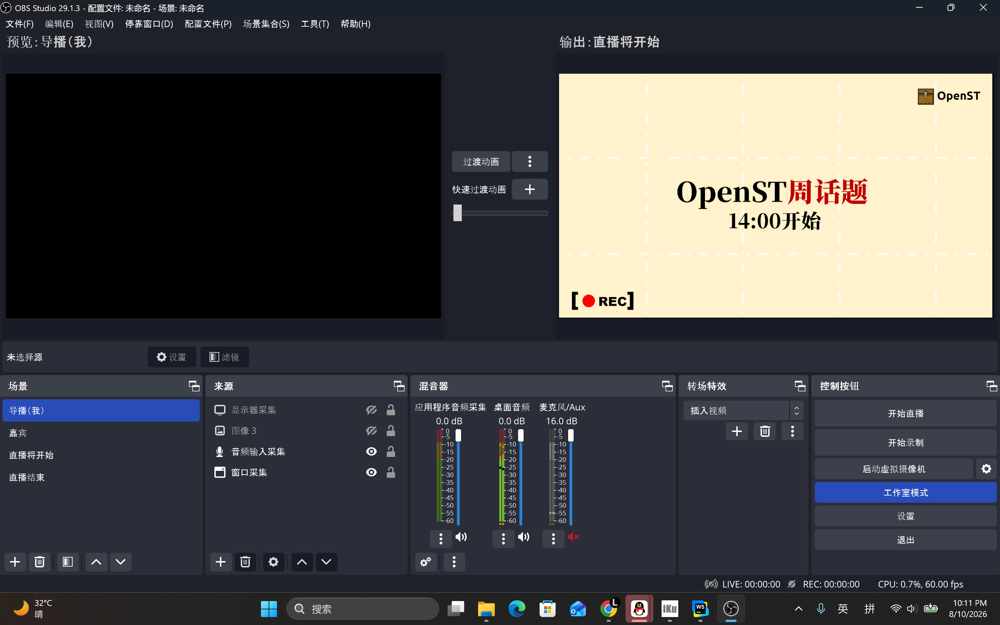

## 前言

> 这个直播流程只测试过双人异地直播。如要用于大规模多机位仅供参考

从第一届直播开始，我本人就在想要如何优化整场直播的效果，使其不是那种围观的感觉。经过第二届失败的尝试过后。终于在第三届做出了优秀的效果，在本文更新前最新的第四届达到了绽放。

# 1.0 基础设施

我们直播采用的是FRP+SRS方案，通过导播obs进行总台调控，同时导播的电脑也作为SRS服务器运行

对于FRP，我们一样还是选择在导播的电脑上运行。我们采用的是OpenFRP，但实际上你可以用其他的内网穿透服务商如樱花

我们通过让嘉宾在他们的obs设置我们自己的直播推流码+直播密钥。拉流的方式则是导播obs内新增媒体源：rtmp://127.0.0.1/live/guest，格式flv。这样我们就完成了对嘉宾画面的拉流

对于直播推流码，一般的格式是：rtmp://[你的FRP提供商给的临时链接+端口]/live，密钥则是guest

最终的直播由导播电脑进行推流到b站

## 1.1 obs设置

在obs设置里面我们设置了四个不同的场景。分别为直播将开始，主持+导播，嘉宾和直播结束

对于每个场景的切换，我们采用了视频转场。转场是采用Adobe Effects制作的。在此感谢Gudu_Z老师为我们设计的转场

## 1.2 音频管理

为了保证音频正确，无回声，和及时传达性。我们在qq语音内关闭了嘉宾的麦，只留下导播的麦克风。因为拉流嘉宾画面的时候导播是听得到嘉宾的音频输入的，而嘉宾却听不到导播的声音。这样做就能让导播一旦发现直播有事情的时候瞬间给嘉宾传达信息
其余的比如开场和结束音乐则是采用了obs新版本的应用程序音频采集测试版。我们用下来没什么问题

# 2.0 人员安排

主持大部分时候负责：

- 节目控制
- 开场介绍
- 内容推进
- 与嘉宾互动
- 控制直播节奏

导播工作：

- OBS 场景切换
- 嘉宾画面控制
- 游戏画面切换
- 等待画面与结束画面管理
- 技术工作
- 检查媒体源
- 处理直播异常
- 监控推流状态
- 处理突发情况

> 在小型活动中，由同一人承担主持和导播可以降低沟通成本，但会增加个人负担

嘉宾负责：

- 内容输出
- 讲解
- 游戏操作
- 展示个人视角
- 与主持互动
- OBS运行
- 麦克风
- 网络稳定

嘉宾不需要负责直播整体流程，只需要保证自己的媒体源稳定

# 3.0 一般情况下的直播流程
- 提前10-20分钟开播
- 主持人开场白
- 嘉宾开始介绍
- 读弹幕
- 主持人做结尾语
- 直播结束图